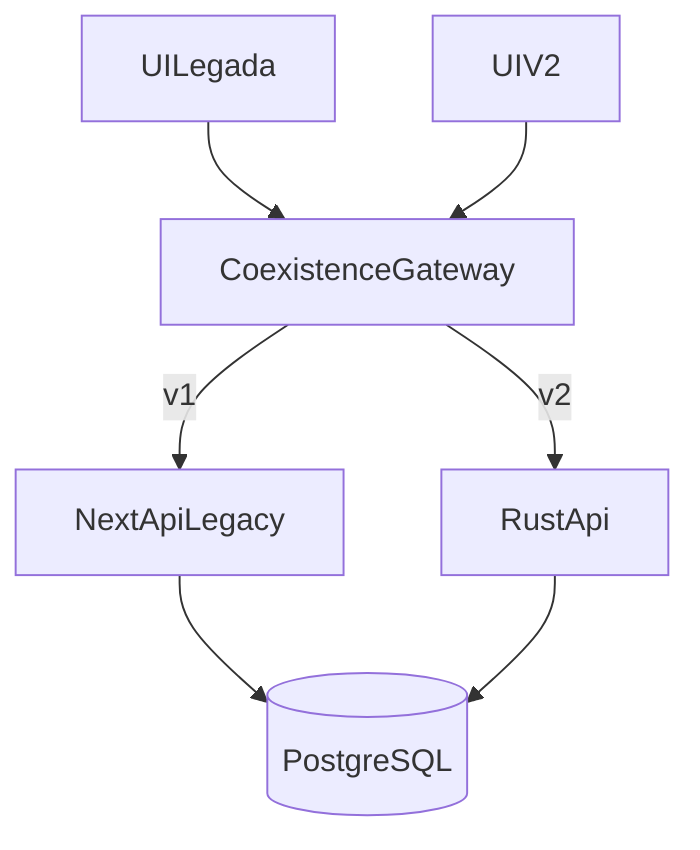

# Arquitetura Alvo de Coexistência

## Princípios
- Sem downtime.
- Compatibilidade reversa.
- Migração por domínio com feature flags.

## Componentes
- **Frontend legado (`app/*`)**: continua operando.
- **Frontend v2 (`app/v2/*`)**: novo design system e rotas modernas.
- **Gateway de coexistência**: roteia requests para legado ou Rust por domínio.
- **Backend legado (Next API routes)**: permanece como fallback.
- **Backend Rust (`backend-rust`)**: novos domínios em produção gradual.
- **PostgreSQL canônico**: estratégia expand/contract.

## Roteamento por versão
- `/api/v1/*` → handlers legados.
- `/api/v2/*` → backend Rust (quando habilitado).
- Feature flags controlam rollout por domínio/tenant/percentual.

## Fluxo de request

## Rollback
- Em incidente: desativar flag do domínio e retornar 100% para `/api/v1`.
- Sem migração destrutiva na mesma janela de corte.
